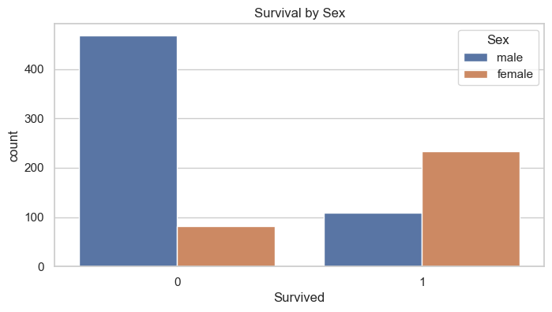
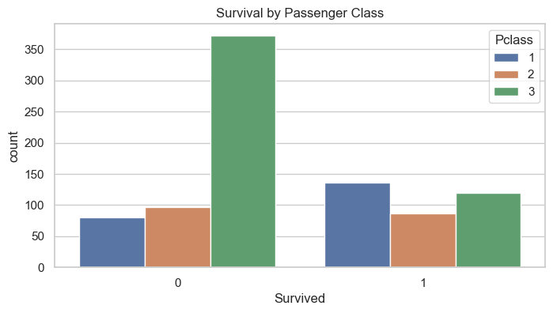
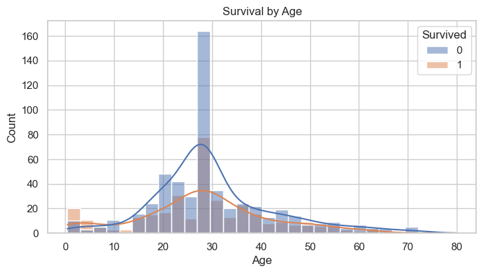
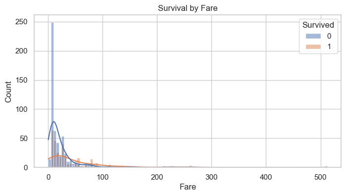
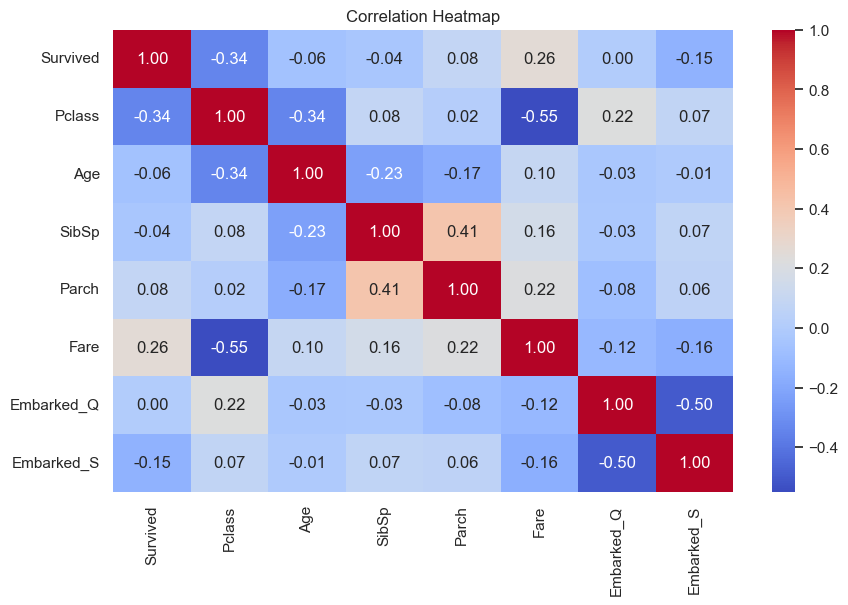
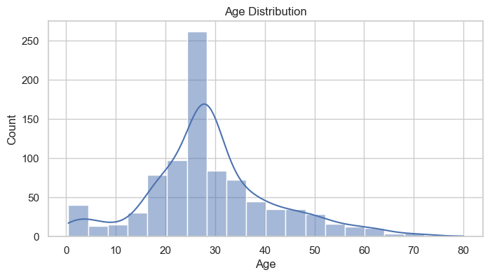

# 🚢 Titanic Dataset – Exploratory Data Analysis (EDA) in Python

**Project ID:** `SCT_DS_2`  
This project performs **Exploratory Data Analysis (EDA)** on the famous **Titanic dataset** using Python in a Jupyter Notebook.  
We explore survival patterns, demographic distributions, and class-based trends through plots and summary statistics.

---

## 📁 Dataset Information

- **Source:** [Kaggle Titanic Competition](https://www.kaggle.com/competitions/titanic)
- **Filename:** `titanic.csv`
- **Description:** Contains data on passengers aboard the RMS Titanic, including features such as:
  - Age
  - Gender
  - Ticket fare
  - Passenger class
  - Survival status

---

## 📊 Visualization Preview

A visual summary of the EDA results is generated using Python plotting libraries and exported as PNG images:

### 🖼️ Dashboard Images

  
  
  
  
  


---

## 🔍 Key Insights

- **Gender & Class Matter:** Women and 1st-class passengers had the highest survival rates.
- **Children Had Better Odds:** Children, especially in higher classes, had better chances of survival.
- **Most Passengers Were in 3rd Class:** A majority of passengers were lower-class males.
- **Fare vs Survival:** Passengers who paid higher fares generally had higher survival rates.

---

## 🧰 Tools & Libraries Used

- `pandas` – Data handling and manipulation  
- `seaborn` – Statistical data visualization  
- `matplotlib` – Basic plotting  
- `plotly` – Interactive charts  
- `Jupyter Notebook` – For code execution and narrative analysis

---

## ▶️ How to Run the Notebook

1. **Clone or download** this repository.
2. **Install the required libraries** using pip:

```bash
pip install pandas matplotlib seaborn plotly
